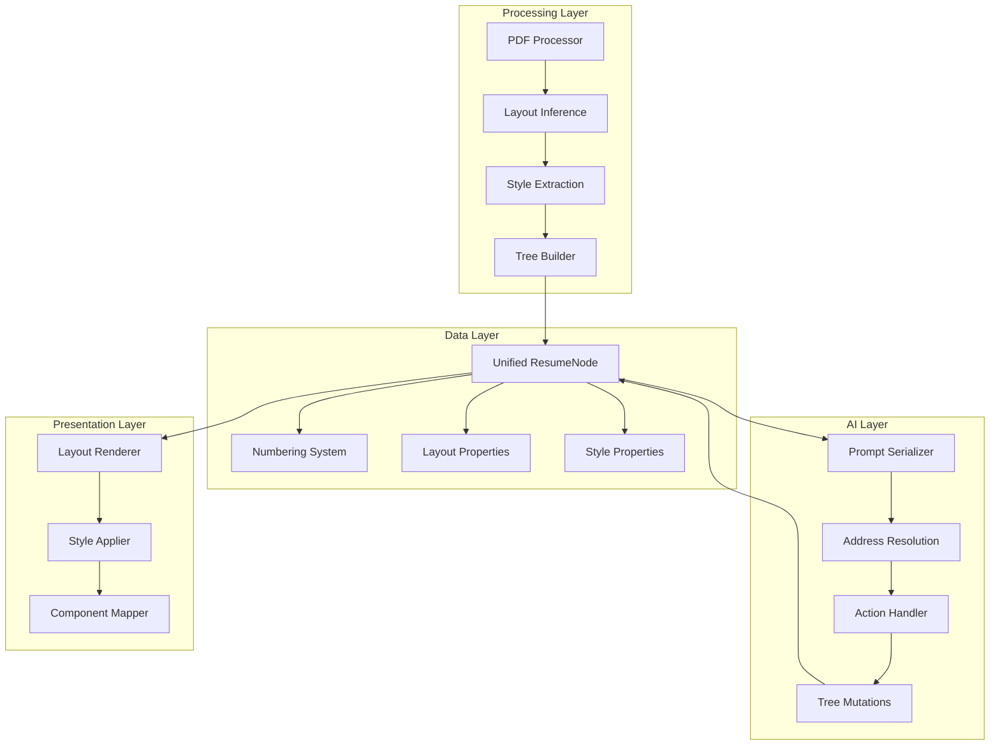

# Design Document

## Overview

The unified node system redesign transforms the Resume Agent from a multi-type node architecture (section/item/bullet/text) to a single, flexible `ResumeNode` type. This design eliminates complexity while maintaining all functionality through layout and style properties. The system supports hierarchical resume structures with AI-friendly addressing, PDF intake with visual inference, and consistent rendering across all content types.

The core principle is separation of concerns: content structure is managed by the unified node tree, while presentation is controlled by `layout` and `style` properties. This approach provides maximum flexibility for both AI agents and rendering systems.

## Architecture

### High-Level Architecture



### Component Relationships

The system follows a unidirectional data flow where:
1. PDF processing creates the initial unified tree
2. AI operations modify the tree through actions
3. Rendering systems consume the tree for display
4. All components share the same unified node structure

## Components and Interfaces

### Core Data Model

#### ResumeNode (Unified)
```typescript
export type ResumeNode = {
  uid: string;                 // Stable unique identifier
  addr?: string;               // Computed address (e.g., "2.1.3")
  
  // Content
  title?: string;              // Optional heading/label
  text?: string;               // Main content text
  
  // Presentation
  layout?: LayoutKind;         // How to render this block
  style?: StyleHints;          // Typography and spacing
  
  // Metadata
  meta?: Record<string, any>;  // Extensible metadata
  
  // Hierarchy
  children?: ResumeNode[];     // Recursive structure
};
```

#### Layout System
```typescript
export type LayoutKind =
  | 'heading'        // Section headers
  | 'paragraph'      // Text blocks
  | 'list-item'      // Bulleted/numbered items
  | 'key-value'      // Label: value pairs
  | 'grid'           // Multi-column layout
  | 'container';     // Generic grouping

export type StyleHints = {
  level?: number;              // Heading level or nesting depth
  listMarker?: 'bullet' | 'number' | 'dash' | 'none';
  indent?: number;             // Indentation amount
  weight?: 'regular' | 'medium' | 'semibold' | 'bold';
  italic?: boolean;
  align?: 'left' | 'center' | 'right';
  // Extensible for color, spacing, etc.
};
```

### Addressing and Numbering System

#### Address Computation
```typescript
export function computeNumbering(tree: ResumeNode[]): Numbering {
  const addrToUid: Record<string, string> = {};
  const uidToAddr: Record<string, string> = {};

  function walk(nodes: ResumeNode[], prefix: number[] = []) {
    nodes.forEach((node, i) => {
      const addr = [...prefix, i + 1].join('.');
      node.addr = addr;
      addrToUid[addr] = node.uid;
      uidToAddr[node.uid] = addr;
      if (node.children?.length) {
        walk(node.children, [...prefix, i + 1]);
      }
    });
  }

  walk(tree);
  return { addrToUid, uidToAddr };
}
```

#### AI Prompt Serialization
```typescript
export function serializeForLLM(tree: ResumeNode[]): string {
  const lines: string[] = [];
  
  function write(node: ResumeNode, depth: number) {
    const addr = node.addr ?? '';
    const pad = '  '.repeat(depth);
    
    const title = node.title?.trim();
    const textPreview = node.text?.trim()?.split('\n')[0];
    const label = title || textPreview || '(untitled)';
    
    // Add .0 suffix for top-level in prompts only
    const printedAddr = depth === 0 ? `${addr}.0` : addr;
    lines.push(`${pad}${printedAddr} ${label}`);
    
    node.children?.forEach((c) => write(c, depth + 1));
  }
  
  tree.forEach((n) => write(n, 0));
  return lines.join('\n');
}
```

### Action System

#### Generic CRUD Operations
```typescript
export type AgentAction =
  | { action: 'appendChild'; parent: string; node: Partial<ResumeNode> }
  | { action: 'insertSibling'; after: string; node: Partial<ResumeNode> }
  | { action: 'replaceText'; id: string; text: string }
  | { action: 'update'; id: string; patch: Partial<ResumeNode> }
  | { action: 'move'; id: string; newParent: string; position?: number }
  | { action: 'remove'; id: string }
  | { action: 'reorder'; id: string; order: string[] };
```

#### Action Handler Implementation
```typescript
export class ActionHandler {
  constructor(
    private tree: ResumeNode[],
    private numbering: Numbering
  ) {}

  apply(action: AgentAction): ResumeNode[] {
    const newTree = cloneTree(this.tree);
    
    switch (action.action) {
      case 'appendChild':
        return this.handleAppendChild(newTree, action);
      case 'replaceText':
        return this.handleReplaceText(newTree, action);
      // ... other handlers
    }
  }
}
```

### PDF Processing and Layout Inference

#### Visual Cue Detection
```typescript
interface LayoutInferenceEngine {
  detectHeadings(styledText: StyledTextItem[]): HeadingCandidate[];
  detectLists(styledText: StyledTextItem[]): ListCandidate[];
  detectKeyValuePairs(styledText: StyledTextItem[]): KeyValueCandidate[];
  detectGridLayouts(styledText: StyledTextItem[]): GridCandidate[];
}
```

#### Heuristics Implementation
- **Headings**: Font size > average + 2px, bold weight, increased spacing
- **Lists**: Leading bullet characters (•, –, ·), consistent indentation
- **Paragraphs**: Multi-line blocks without list markers
- **Key-Value**: Colon patterns, consistent alignment
- **Grids**: Multi-column X-coordinate clustering

### Rendering System

#### Component Mapping
```typescript
const LayoutComponents = {
  heading: ({ node, style }) => <Heading level={style.level}>{node.title || node.text}</Heading>,
  paragraph: ({ node }) => <Paragraph>{node.text}</Paragraph>,
  'list-item': ({ node, style }) => <ListItem marker={style.listMarker}>{node.text}</ListItem>,
  'key-value': ({ node }) => <KeyValue label={node.title} value={node.text} />,
  grid: ({ node }) => <Grid>{node.children?.map(renderNode)}</Grid>,
  container: ({ node }) => <Group>{node.children?.map(renderNode)}</Group>
};
```

## Data Models

### State Management
```typescript
interface AppState {
  // Core data
  resumeTree: ResumeNode[];
  numbering: Numbering;
  
  // Metadata
  resumeTitle: string;
  textDirection: 'ltr' | 'rtl';
  language: string;
  
  // Operations
  applyAction: (action: AgentAction, description: string) => void;
  recomputeNumbering: () => void;
}
```

### Migration Adapters
```typescript
interface LegacyAdapter {
  convertSectionNode(oldNode: SectionNode): ResumeNode;
  convertItemNode(oldNode: ItemNode): ResumeNode;
  convertBulletNode(oldNode: BulletNode): ResumeNode;
  
  // Action adapters
  adaptAppendSection(title: string): AgentAction;
  adaptAppendItem(parentId: string, content: string): AgentAction;
  adaptAppendBullet(parentId: string, text: string): AgentAction;
}
```

## Error Handling

### Validation System
```typescript
interface ValidationEngine {
  validateNode(node: ResumeNode): ValidationError[];
  validateTree(tree: ResumeNode[]): ValidationError[];
  validateAction(action: AgentAction): ValidationError[];
}

type ValidationError = {
  type: 'missing_uid' | 'invalid_layout' | 'empty_container' | 'invalid_address';
  message: string;
  path: string;
  severity: 'error' | 'warning';
};
```

### Error Recovery
- **Invalid Actions**: Rollback to previous state, log error
- **Malformed Nodes**: Apply default values, continue processing
- **Address Conflicts**: Recompute numbering, update references
- **PDF Processing Failures**: Fallback to text-only extraction

### Graceful Degradation
- Missing layout properties default to 'container'
- Missing style properties use system defaults
- Corrupted tree sections are isolated and marked for review

## Testing Strategy

### Unit Testing
- **Node Operations**: CRUD operations, validation, cloning
- **Numbering System**: Address computation, resolution, updates
- **Action Handlers**: Each action type with edge cases
- **Layout Inference**: Heuristic accuracy with sample PDFs

### Integration Testing
- **PDF Processing**: End-to-end PDF → tree conversion
- **AI Integration**: Prompt generation and action parsing
- **State Management**: Action application and history tracking
- **Rendering**: Layout → component mapping

### End-to-End Testing
- **User Workflows**: Upload PDF → edit → export cycle
- **Migration Testing**: Legacy data conversion accuracy
- **Cross-browser**: Rendering consistency across browsers
- **Performance**: Large resume handling (100+ nodes)

### Test Data Strategy
- **Sample PDFs**: Various formats, layouts, languages
- **Edge Cases**: Empty sections, complex hierarchies, special characters
- **Performance Tests**: Large trees, rapid mutations
- **Migration Tests**: Legacy format compatibility

### Automated Testing
```typescript
describe('Unified Node System', () => {
  describe('Node Operations', () => {
    it('should create nodes with required properties');
    it('should maintain UID uniqueness');
    it('should handle deep nesting');
  });
  
  describe('Addressing', () => {
    it('should compute correct addresses');
    it('should handle tree mutations');
    it('should resolve addresses to UIDs');
  });
  
  describe('Actions', () => {
    it('should apply appendChild correctly');
    it('should handle invalid addresses gracefully');
    it('should maintain tree integrity');
  });
});
```

### Performance Benchmarks
- Tree operations: < 10ms for 1000 nodes
- Address computation: < 5ms for complex trees
- PDF processing: < 30s for typical resumes
- Rendering: < 100ms for full tree render